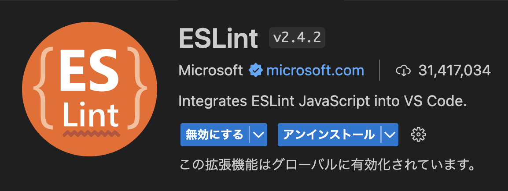
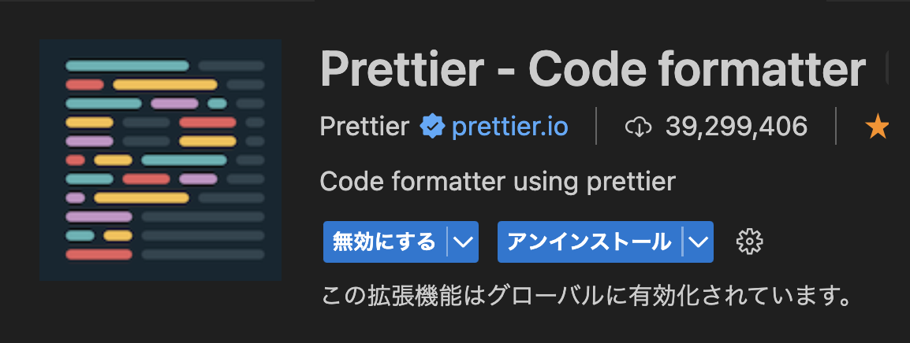
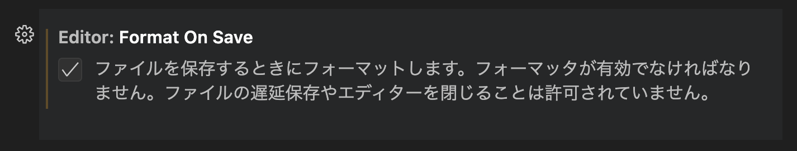
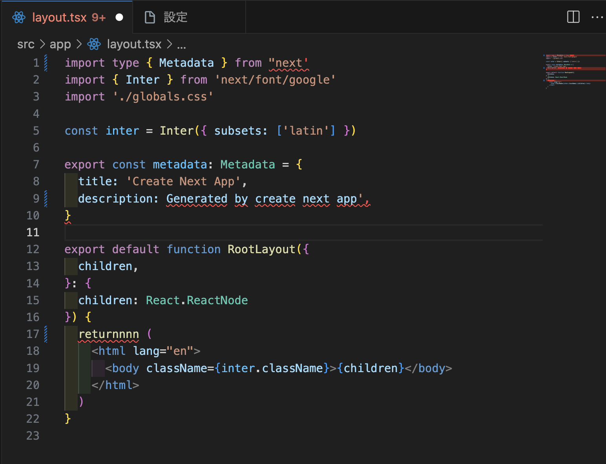
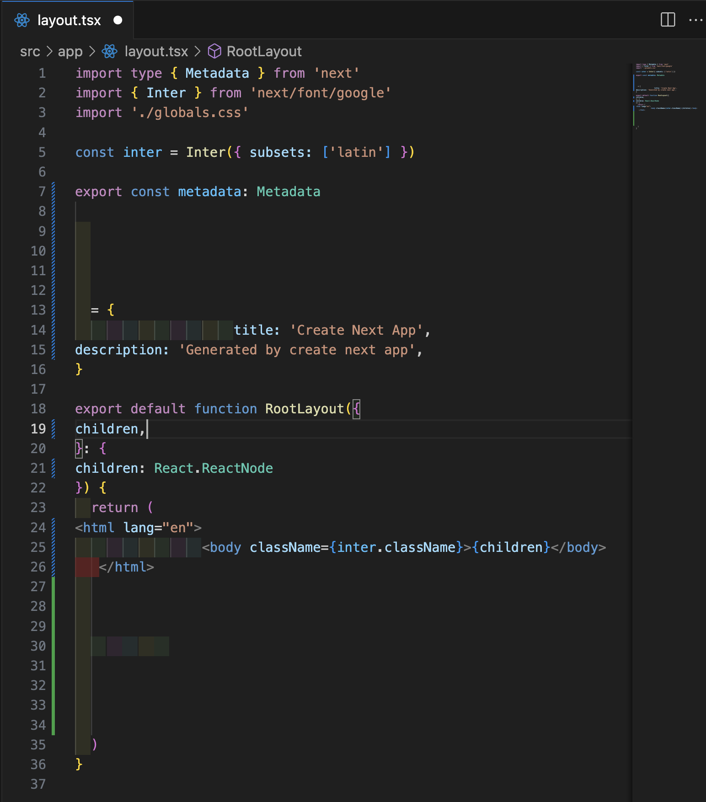
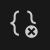
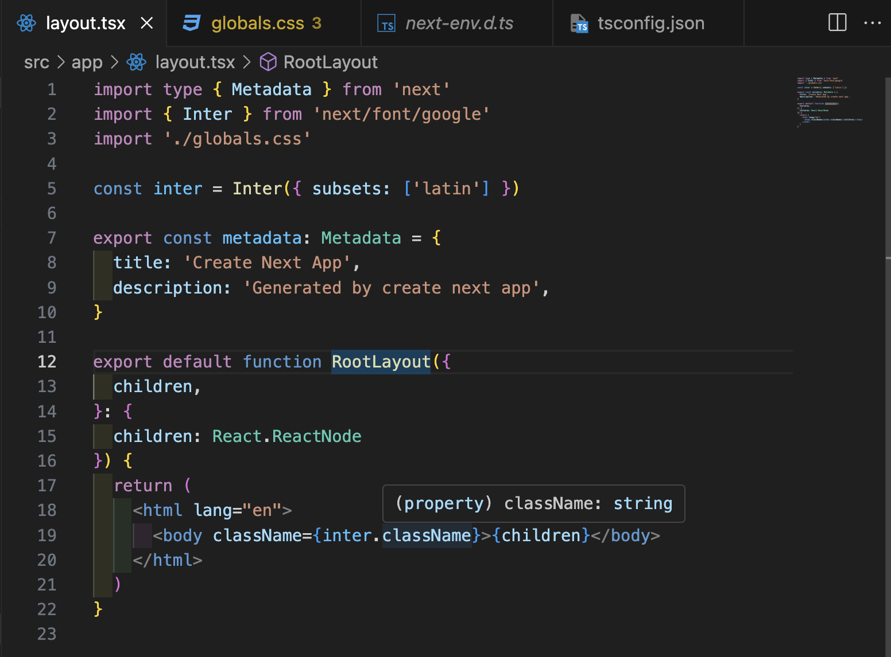

# フォーマッターを設定して、綺麗なコードを書けるようにする

## VScodeをインストールする

[インストールサイト](https://code.visualstudio.com/download)

## 拡張機能をインストールする

VScodeを開いて、左のバーにある↓のアイコンから拡張機能をインストールする。

以下の二つを検索欄から検索してインストールする。

- eslint
    
- Prettier
    

## セーブした時に自動でフォーマット

VSCodeの設定画面を開いてこれにチェックをつける

設定画面はMacなら`command+,`、Windowsは`Ctrl+,`で開かれる。

左下の歯車アイコンからも開ける

## ちゃんと動いているか確認

### ESLint

1. tanken_appを開いて、適当なTSXファイルを開く。
2. 変な書き方をするとコードに赤い線が引かれたりするならESlintが動いている！

### Prettier

1. tanken_appを開いて、適当なTSXファイルを開く。

2. ファイルを画像のように汚くしてみる。

    

3. フォーマッターを選択する

    Macなら`option+Shift+F`、Windowsなら`Alt+Shift+F`を押してフォーマッターを実行する。

    トラブルシューティング

     - 「フォーマッタを選択」のようなことが表示されたらPrettierを設定する
     - 何も表示されなければ、下のバーにあるこのアイコンを押して[書式設定]=>[構成]からPrettierを設定する

        

4. `Shift+S`や`(option or Alt)+Shift+F`でコードが整形される！

    

    `(option or Alt)+Shift+F`では成形されるが、`Shift+S`で成形されない時は、FormatOnSaveにチェックされていないかも。
